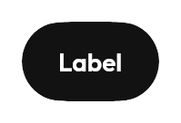
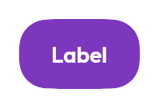
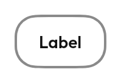
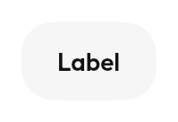
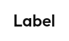
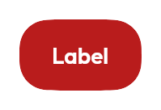
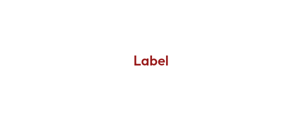
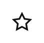
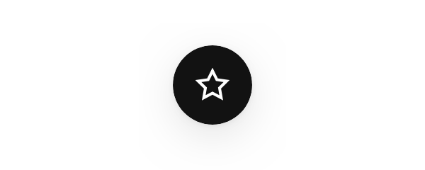
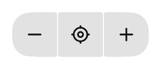

# Actions

Things the user presses to make something happen.

| | For | Instead of |
|---|---|---|
| [`Button`](#button) | An action with a name | An `IconButton`, when there is room for the word |
| [`IconButton`](#iconbutton) | An action with no room for a name | A `Button`, whenever there is room |
| [`IconToggleButton`](#icontogglebutton) | An icon that is on or off — favourite, mute | A `Switch`, when the state deserves a label |
| [`FloatingActionButton`](#floatingactionbutton) | The one action a whole screen exists for | A `Button`, for anything else |
| [`ButtonGroup`](#buttongroup) | Related actions that read as one control | `SegmentedControl`, when one is *selected* |
| [`Toolbar`](#toolbar) | A floating surface of actions over other content | `TopBar`, when it is the screen's own chrome |
| [`Spinner`](#spinner) | Work is happening, duration unknown | `LinearProgress`, when you know the fraction |

---

## `Button`

```kotlin
Button(onClick = ::plan) {
    +"Plan a trip"
}

Button(
    onClick = ::delete,
    variant = ButtonVariant.Destructive,
    size = ButtonSize.Small,
) {
    +Tabler.Outline.Trash
    +"Delete"
}
```

The content is a `RowContentScope`, so `+"text"` and `+icon` are the whole
vocabulary — see [`dsls.md`](../dsls.md). There is no `label: String`: a button
whose content is a slot can hold a label with a badge, a two-line label, or a
row with a trailing chevron, and none of those needed a new parameter.

### Seven variants, chosen by importance rather than appearance

| Variant | For | |
|---|---|---|
| `Primary` | The one action the screen exists for. At most one per screen. Solid, near-black |  |
| `Accent` | The place the product should show up as itself — "Get started", "Plan a trip". Solid, in the accent tone |  |
| `Secondary` | A real alternative to the primary action. Outlined |  |
| `Tertiary` | Supporting actions that should not compete. Filled with a soft ground |  |
| `Ghost` | Lowest weight — toolbar actions, inline "edit". No ground until hovered |  |
| `Destructive` | Deletes, cancels a booking, ends a trip |  |
| `DestructiveGhost` | A destructive action that should not shout — inside a menu or row |  |

`Primary` and `Accent` are **alternatives to each other, not companions**. Two
solid buttons on one screen is still one too many.

Five sizes, `XSmall` to `XLarge`, drawn from `Theme.sizing.controlHeight*` so a
row of mixed buttons, inputs and selects lines up without per-call-site padding.
`Medium` is the default; `Large`/`XLarge` are for a screen's single main call to
action.

### States

**Loading** swaps the label for a spinner *without changing the button's width*,
so a row of buttons does not reflow when one is pressed. The button also blocks
input and announces itself as busy while loading — a screen-reader user is not
left tapping a control that already took their input.

**Disabled** styling is shared across variants on purpose: a disabled outlined
button and a disabled solid one both mean "not available right now", and should
not look like two different controls.

### Accessibility

The content slot is the accessible name, so a button whose content is only an
icon has no name — that is what `IconButton` is for, and why its
`contentDescription` is required. `ComponentContractTest` fails a registered
component that announces nothing, which is what replaced the guarantee the old
`label: String` parameter gave.

---

## `IconButton`


```kotlin
IconButton(Tabler.Outline.X, contentDescription = "Close", onClick = ::dismiss)

IconButton(
    icon = Tabler.Outline.ChevronDown,
    contentDescription = "Expand",
    onClick = ::toggle,
    rotation = if (expanded) 180f else 0f,
)
```

`contentDescription` is **required and non-null**. There is no visible text to
fall back on, so an icon button without one is a control a screen-reader user
cannot identify. If the icon is genuinely decorative, it is not a button.

`rotation` animates, which is what makes a disclosure chevron read as the same
arrow turning rather than two different glyphs swapping.

It defaults to `ButtonVariant.Ghost` and `Theme.shapes.pill`, because an icon
button is nearly always a low-weight action inside something else. Both are
parameters when it is not.

## `IconToggleButton`



```kotlin
IconToggleButton(
    icon = Tabler.Outline.Star,
    contentDescription = "Favourite",
    checked = isFavourite,
    onCheckedChange = viewModel::setFavourite,
)
```

Announces `Role.Checkbox`, not `Role.Switch`. It reads as one — a star that is
on or off — but a switch describes the sliding control, and a screen reader that
says "switch" for a star describes a widget that is not on screen. The contract
suite found this component announcing `Role.Switch` from a wrapper `Box` around
an `IconButton` that announced `Role.Button`: a switch containing a button, and
the wrong role either way.

**Reach for `SelectionRow` with a `Switch` instead** when the thing being toggled
deserves a written label. An icon toggle is for a dense row of actions where the
glyph is the whole affordance.

---

## `FloatingActionButton`



```kotlin
FloatingActionButton(Tabler.Outline.Plus, "Add favourite", onClick = ::add)
```

One per screen. A second FAB is two competing "the" actions.

## `ExtendedFloatingActionButton`


```kotlin
ExtendedFloatingActionButton(
    icon = Tabler.Outline.Navigation,
    contentDescription = "Start trip to Perth Station",
    expanded = !listState.isScrollingDown,
    onClick = ::start,
) { +"Start" }
```

It animates its *width* when collapsing rather than cross-fading between two
components, so the icon stays put and the label slides out from behind it.
Cross-fading makes the icon appear to jump sideways. `NavRail` uses the same
treatment when it expands.

`contentDescription` is separate from `label` because the label may be terse
where the announcement should not be — "Start" on screen, "Start trip to Perth
Station" for a screen reader.

---

## `ButtonGroup`



```kotlin
ButtonGroup {
    item(onClick = ::zoomOut, contentDescription = "Zoom out", icon = Tabler.Outline.Minus)
    item(onClick = ::recentre, contentDescription = "Recentre", icon = Tabler.Outline.CurrentLocation)
    item(onClick = ::zoomIn, contentDescription = "Zoom in", icon = Tabler.Outline.Plus)
}
```

The buttons sit flush and only the outside corners round — the same treatment
[`ListItemPosition`](collections.md#listitem) gives a group of rows. That is the
whole visual idea: three separate buttons say "three things", one joined group
says "one thing, three ways".

It is a **builder**, not a row of `Button`s, because each button's shape depends
on how many there are — which is not known until they have all been declared.
Note that the builder collects rather than composes, so a `@Composable` helper
cannot be called inside it; hoist the value first.

### Not a `SegmentedControl`

They look almost identical and mean opposite things:

| | `ButtonGroup` | [`SegmentedControl`](selection.md#segmentedcontrol) |
|---|---|---|
| Each item is | an action | an option |
| Something is selected | no | always exactly one |
| Role | `Button` | `RadioButton` |
| Pressing one | does something | changes a value |

A segmented control with no selection is broken; a button group with a selection
is a segmented control wearing the wrong clothes. **If the row answers a
question, it is a segmented control.**

### Not `TopBar`'s `actions`

That slot holds the *screen's* actions, separated from each other. This is a
cluster that belongs together — zoom in and zoom out — and the joining is what
says so. A [`TopBar`](navigation.md#topbar) can hold one of these in its slot.

Any single action can be disabled without the others, which is what lets a
cluster grey a button rather than hide it. A cluster that changes width as you
use it is worse than one with a greyed button in it.

## `Toolbar`


```kotlin
Toolbar {
    ButtonGroup {
        item(onClick = ::zoomOut, contentDescription = "Zoom out", icon = Tabler.Outline.Minus)
        item(onClick = ::zoomIn, contentDescription = "Zoom in", icon = Tabler.Outline.Plus)
    }
    ToolbarDivider()
    IconButton(Tabler.Outline.Stack, "Map layers", onClick = ::openLayers)
}
```

A floating surface holding actions, over content it does not belong to — the
controls over the map.

**Deliberately thin**: a `Surface` and a `Row`. It earns its place the way
[`Card`](display.md#card) does, by fixing the elevation, shape, padding and
traversal semantics in one place so a second toolbar does not grow a second set
of numbers.

**It is not a [`TopBar`](navigation.md#topbar).** A top bar is *part of* the
screen — it holds the title and sits at the top. A toolbar floats **over**
content that is not its own, which is why it has a shadow and rounded corners
and a top bar has neither. If it is the screen's chrome, it is a top bar.

For a translucent one over a live map, use `GlassSurface` and read the note in
[adaptive](adaptive.md#there-is-no-portable-backdrop-blur) — there is no
portable backdrop blur.

---

## `Spinner`

An indeterminate activity indicator. The arc sweeps *and* breathes — its length
grows and shrinks as it rotates, so the tail chases the head. Under reduced
motion the breathing stops and the arc holds a constant length.

```kotlin
Spinner(contentDescription = "Loading departures")
```

`contentDescription` defaults to `null`, which is right when the spinner sits
inside something that already announces itself as busy — a loading `Button`
does, so its spinner is silent. Pass one when the spinner is the only thing
saying work is happening.

**Reach for `LinearProgress` or `ProgressRing` instead** when the fraction is
known. A spinner says "wait"; a progress bar says how long, and people wait
longer when they can see the end. Both are in
[display.md](display.md#progress).
