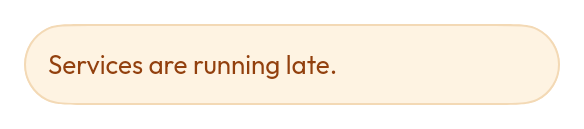

# `Banner` / `AnimatedBanner`



An inline message, four severities. `AnimatedBanner` is the same thing that
animates its own appearance and dismissal, for a banner whose presence is driven
by state.

<!--sample:BannerBasics-->
```kotlin
var showing by remember { mutableStateOf(true) }

if (showing) {
    Banner(tone = BannerTone.Warning, onDismissRequest = { showing = false }) {
        title { +"Track work this weekend" }
        message { +"Buses replace trains between Perth and Bayswater until Monday." }
        action {
            Button(onClick = { plan() }, variant = ButtonVariant.Ghost, size = ButtonSize.Small) {
                +"Plan around it"
            }
        }
    }
}
```

**`Banner` vs `Toast`.** A banner is about the screen you are on; a toast is
about something you just did. A banner that appears in response to a tap is easy
to miss, because the user is looking at their finger.

`Danger` banners announce assertively and everything else politely —
interrupting for a routine notice trains people to ignore the interruption.

---

← [Display and content](display.md) · [All components](../components.md)
