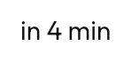

# Date and time

| | For | Instead of |
|---|---|---|
| [`CalendarMonth`](#calendarmonth) | Building your own picker | A picker, unless you need the grid |
| [`DatePicker`](#datepicker) | One date | — |
| [`DateRangePicker`](#daterangepicker) | A start and an end | Two `DatePicker`s |
| [`TimePicker`](#timepicker) | An hour and a minute | — |
| [`TimeField`](#timefield) | The tappable field that opens one | — |
| [`WheelPicker`](#wheelpicker) | Any list of values, as a drum | A `Select`, in a form |
| [`RelativeTimeText`](#relativetimetext) | A self-updating "in 4 min" | A formatted timestamp |
| [`DateTimeFormats`](#datetimeformats) | 12/24-hour and day-first, app-wide | Per-call-site formatting |

---

## `CalendarMonth`

The reusable grid, with no opinion about how selection works.

**It expresses selection as *predicates* rather than a value**, because that is
the only shape that serves single, range and multi-select without the grid
knowing which mode it is in.

Range endpoints get a rounded cap and the interior stays square, so a run reads
as continuous rather than as a row of separate pills.

> A day cell used to announce its selection from a decorative sibling, so a
> screen reader could read a date as selected when it was not. Found by the
> contract suite.

## `DatePicker`

Single date, with month paging.

## `DateRangePicker`

Start and end, with a continuous run between them.

**It follows the rule users expect without being told**: the first tap sets the
start and clears any end, the second sets the end, and tapping before the
current start *restarts* the range there rather than producing a backwards one.

A multi-month scrolling calendar, for ranges that cross a month boundary
comfortably, is [not yet built](../components.md#not-yet-built).

## `TimePicker`

**Wheels rather than a clock dial.** In a transit app the value is almost always
being *adjusted* ("leave at 8:15 instead of 8:00"), and a wheel gets there in one
flick where a dial needs two precise drags.

AM/PM appears as a third wheel on a 12-hour clock, which is a
[`DateTimeFormats`](#datetimeformats) decision rather than a parameter.

## `TimeField`

The tappable field that opens a `TimePicker`. It is a field, like
[`Select`](text-editing.md#select) — same frame, same label, same error slot.

## `WheelPicker`

**Grab it with a mouse.** A `LazyColumn` answers touch and the wheel, and on
desktop that is all — which is right for a list and wrong for a drum. Nobody
sets a time by scrolling a picker with a wheel.

The scrolling drum, for any list of values. `TimePicker` is three of these.

**Reach for a [`Select`](text-editing.md#select) instead** inside a form. A drum
is right when the value is one of a long ordered run and the user is adjusting
it; a select is right when they are choosing from a list.

---

## `RelativeTimeText`

**It re-renders at the resolution it is displaying** — every second under a
minute, every twenty above — rather than on a fixed timer that is either
wasteful or stale.

**It rounds down.** Telling someone their bus is 2 minutes away when it is 90
seconds away is the error that makes them miss it.

It is a polite live region, so a screen reader announces the change without
interrupting whatever is being read.

## `DateTimeFormats`

Carries the two preferences users actually notice — 12/24-hour and day-first —
because "05/06" is two different days depending on the answer. Also the
first-day-of-week.

Provided once at the root through `LocalDateTimeFormats`.
