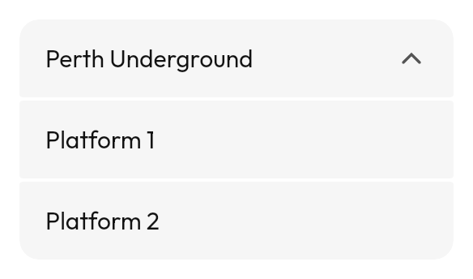

# `ExpandingListItem`



<!--sample:ExpandingListItemBasics-->
```kotlin
var open by remember { mutableStateOf(false) }

ListGroup {
    item(label = "Elizabeth Quay", supporting = "3 routes")
}
ExpandingListItem(
    expanded = open,
    onExpandedChange = { open = it },
    chevron = Tabler.Outline.ChevronDown,
    header = {
        leading { +Tabler.Outline.Bus }
        +"Perth Underground"
        supporting { +"4 platforms" }
    },
) {
    item(label = "Platform 1", supporting = "Mandurah line")
    item(label = "Platform 2", supporting = "Joondalup line")
}
```

A row that opens onto more rows. The header takes a `ListItemScope`, so it is
written exactly like any other row; the body takes the **same `ListGroupScope`**
a [`ListGroup`](list-item.md) does, so what comes out is rows rather than a panel.

**The seams are the whole of it.** Shut, the header is whatever `position` says
it is. Open, it becomes the *first* of a longer run: its bottom corners square
off, the children take the middle, and the last child rounds off the bottom. The
group reads as one object unfolding rather than as a card appearing under a pill.
That is why the children come from a scope rather than being emitted by the
caller — a caller writing bare `ListItem`s would have to compute those positions
itself, which is the thing this exists to prevent.

**Reach for [`Accordion`](accordion.md) instead** when what opens is
arbitrary content. The two are near-twins and the difference is what comes out:

| | `ExpandingListItem` | `Accordion` |
|---|---|---|
| Header | A `ListItem` | Its own header, in a `ListItem`'s shape |
| Body | More rows | Anything |
| In a `ListGroup` | Continues the run | Sits in it as a foreign object |

An empty body draws no chevron and does not respond to a tap: a disclosure
control that opens onto nothing is a promise the row cannot keep.

---

← [Collections](collections.md) · [All components](../components.md)
