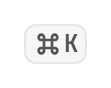

# `Kbd`



A keyboard shortcut rendered as a key. Used by `MenuScope.item(shortcut = …)`
and available directly.

<!--sample:KbdBasics-->
```kotlin
Row(horizontalArrangement = Arrangement.spacedBy(Theme.spacing.xs)) {
    Kbd { +"⌘" }
    Kbd { +"K" }
    Text("opens the command palette", style = Theme.typography.bodySmall)
}
```

It has no role, no disabled state and no touch target, which is why it is in the
registry as a render-only specimen — see
[`building/testing.md`](../../building/testing.md#one-list-two-consumers).

---

← [Display and content](display.md) · [All components](../components.md)
