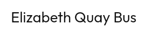

# `Modifier.marquee`



<!--sample:MarqueeBasics-->
```kotlin
Text(
    text = stop.name,
    maxLines = 1,
    modifier = Modifier.marquee(),
)
```

For the label that is *usually* short and occasionally is not — a stop name, a
route headsign, a now-playing line. Safe to apply unconditionally: it measures
first and animates only when the content is wider than the space, so the common
case costs a comparison. Pair it with `maxLines = 1`; without that the text wraps
instead of overflowing, there is nothing to scroll, and the modifier does nothing
forever.

**It is off under reduced motion, and that is not a degradation.** Everything
else in this library softens — a spring becomes a tween, a slide becomes a fade.
This one stops entirely, because it is the one animation here that never ends,
and perpetual motion at the edge of vision is the specific thing that preference
exists to stop. The text truncates instead, which is what it would have done
without the modifier at all. The picture above is that state.

`iterations` defaults to three passes. `Int.MAX_VALUE` gives a ticker that never
stops — right for a live status line, wrong for a list, where a dozen rows all
scrolling at once is a screen nobody can read.

It wraps foundation's `basicMarquee` rather than replacing it. That already
measures, already stops when the content fits, already handles right-to-left.
What it does not have is this library's pace or any knowledge of `reduceMotion`,
and those are the two things worth owning.

---

← [Display and content](display.md) · [All components](../components.md)
