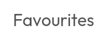
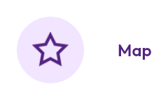
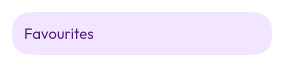
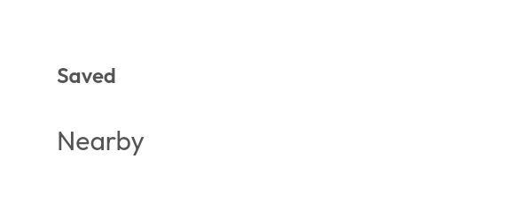
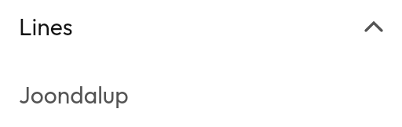
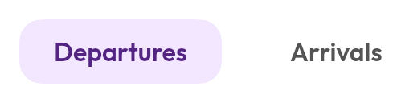

# Navigation

| | For | Instead of |
|---|---|---|
| [`NavigationSuiteScaffold`](#navigationsuitescaffold) | **Start here.** Destinations, placed by window size | Picking a surface by hand |
| [`NavItem`](#navitem) | One destination, declared once | Three copies, one per surface |
| [`NavBar`](#the-three-surfaces) | Compact windows — bottom of the screen | — |
| [`NavRail`](#the-three-surfaces) | Medium windows — leading edge | — |
| [`NavDrawer`](#the-three-surfaces) | Expanded windows, and nested groups | `NavRail`, for a flat set |
| [`TopBar`](#topbar) | A title and its actions | Anything holding destinations |
| [`TabBar`](#tabbar) | Views of *one* screen | `SegmentedControl`, when switching a value |
| [`Breadcrumbs`](#breadcrumbs) | Where you are in a hierarchy | — |
| [`Pagination`](#pagination) | Numbered pages | `LoadMore`, in an app |

Routes and the back stack are not in `:ui` — they are in `:core:navigation`.
This page is about the surfaces that draw them.

---

## `NavigationSuiteScaffold`

Picks the surface from the window size and places it, so a screen declares its
destinations once and never arranges them.

| Window | Surface | Placement |
|---|---|---|
| Compact (< 600dp) | `NavBar` | **Bottom of the screen**, over the content |
| Medium (< 840dp) | `NavRail` | **Leading edge**, icons only, beside the content |
| Expanded and up | `NavDrawer` | **Leading edge**, labels always shown |

**This is an app, not a website.** Destinations live at the bottom on a phone
because that is where a thumb reaches, and move to the leading edge on a wide
window because a horizontal bar there eats the dimension there is least of. A
[`TopBar`](#topbar) in this system is a title and its actions — never a place to
put destinations.

**The bar overlays the content** rather than sitting below it, matching the
floating toolbar the app uses over its map. The scaffold hands your content the
padding to inset by, the same way a map insets its controls by a sheet's
`visibleHeight`.

## `NavItem`

One destination — icon, label, optional badge and content description —
rendered by whichever surface fits. It is what removes the second and third copy
of the same three destinations.

---

## The three surfaces




The same three selected. Each surface draws the indicator its own way — a filled
circle, a pill behind the icon, a pill across the whole row — and that indicator
is the only thing distinguishing a destination you are on from one you are not:





`NavBar` and `NavRail` take a `List<NavItem>`. **A drawer takes a slot, not a
list**: a drawer is where destinations stop being a flat set of three, and a
list model would be a tree wearing a list's shape.

### Why the bar has no bar

`NavBar` is free-standing circles floating over whatever the screen is showing.
What makes a row of destinations read as navigation is the **travelling
circle**, not the container they sit in — and over a map or a photo a container
is a strip of the content you cannot see. The marker moves between
destinations; that is the whole of the chrome.

Each circle carries its own elevation, which is enough to separate it from a
map. Over a photo or a promotional banner it is not, and `backdrop` adds a
vertical fade from transparent to the page colour behind the whole row. The fade
is *drawn*, not laid out — it reaches 128dp up the screen without the bar
measuring a pixel taller, because the scaffold hands that measurement to your
content as padding.

**The bar is as tall as the target it reserves, and no taller.** A destination
draws a 40dp circle inside the 48dp `Theme.sizing.minTouchTarget` reserves around
it, so the air above and below the circles is the touch target's own rather than
padding added on top of it. On a phone that is 48dp of bar, plus whatever the
gesture bar underneath asks for.

`showLabels` is off by default. A word under every icon is a row of words, and
the destinations of an app this size are the four or five its user already
knows. Turn it on for an app whose icons are not obvious.

### A search field in the middle of it

<!--sample:NavBarCentreSearch-->
```kotlin
var current by remember { mutableStateOf(0) }
val search = rememberNavSearchState()

val destinations = listOf(
    NavItem(label = "Home", icon = Tabler.Outline.Home, onClick = { current = 0 }),
    NavItem(label = "Map", icon = Tabler.Outline.Map, onClick = { current = 1 }),
    NavItem(label = "Plan", icon = Tabler.Outline.Calendar, onClick = { current = 2 }),
    NavItem(label = "Profile", icon = Tabler.Outline.User, onClick = { current = 3 }),
)

NavBar(
    items = destinations,
    selectedIndex = current,
    search = { NavSearch(state = search) },
    searchIndex = destinations.size / 2,
)
```

`searchIndex` decides where among the destinations the `search` slot goes;
`items.size / 2` is the middle, with two either side. `null` — the default —
puts it after them all.

**Tapping the pill expands it into an overlay, not into a taller bar.** A
navigation bar clears `WindowInsets.bottomEdges`, whose own documentation says
why: *"A navigation bar holds no text field and should stay where it is while
the user types."* A bar riding up on the keyboard would contradict the inset it
asks for. So the pill stays put and the expanded field goes into the
`OverlayHost`, which brings the scrim, back and escape, and trapped focus with
it.

`NavExpandPlacement` says where it lands. `AboveKeyboard` keeps the field near
the thumb that opened it and stacks results upward; `Top` puts it where a
browser puts one and reads the results downward. Both are built because the
answer is a question about your app rather than about the component.

**The pill sits on `surface` with the destinations' own shadow**, not in the
`surfaceSunken` well a text field uses. It is a raised thing on the page beside
other raised things; a sunken control on a sunken page has no edge at all.
`containerColor` and `contentColor` are there for an app that wants otherwise.

### The same shape without a search in it

`NavExpandingSlot` is the pill-and-panel underneath
`NavSearch`, and it knows nothing about searching. A filter, an account
switcher, a "where to?" prompt and a compose box are all the same thing: a small
control in the bar that needs the whole screen once it is in use.

```kotlin
var open by remember { mutableStateOf(false) }

NavExpandingSlot(
    expanded = open,
    onExpandedChange = { open = it },
    expandedContent = { FilterList(onPick = { open = false }) },
) {
    +Tabler.Outline.Filter
    +"Filters"
}
```

### Slot content that knows how much room it has

`LocalNavExpansion` tells whatever is in a `header`, `action`, `footer` or
`search` slot how wide the surface around it currently is — `expanded` for
whether there is room for a word, `progress` for interpolating across a rail's
animation.

```kotlin
NavRail(items, selectedIndex = current, header = {
    val room = LocalNavExpansion.current
    Row { Avatar(user); if (room.expanded) Text(user.name) }
})
```

This is what makes `NavSearch` a pill in a bar and a field in a drawer with no
parameter at the call site, and it is deliberately not about search: a profile
row that gains a name, a button that drops its label, a chip that becomes an
icon are the same question. Before it, the only way to answer it was to thread
your own copy of the rail's `expanded` flag down by hand — and that flag is the
*target*, not the animated width, which is the mistake the rail itself spent a
round unlearning.

`NavigationSuiteScaffold` passes `search` and `searchIndex` through to the bar,
and to the bar only — a rail and a drawer have a leading edge and room to spare,
and how a wide window searches is a screen's decision.




`NavDrawerSection` separates a titled run of destinations; `NavDrawerGroup`
nests them behind a disclosure. The group's expansion is hoisted, so the app can
open the group containing the current page — which is nearly always right and
not something the component can know.

`ModalNavDrawer` is the same drawer rendered into the `OverlayHost`, for a
narrow window where it slides over the content instead of sitting beside it.

### The rail expands

<!--sample:NavRailExpanding-->
```kotlin
var current by remember { mutableStateOf(0) }
var railOpen by remember { mutableStateOf(false) }

val destinations = listOf(
    NavItem(label = "Plan", icon = Tabler.Outline.Map, onClick = { current = 0 }),
    NavItem(label = "Saved", icon = Tabler.Outline.Star, onClick = { current = 1 }),
)

NavRail(
    items = destinations,
    selectedIndex = current,
    expanded = railOpen,
    onExpandedChange = { railOpen = it },
)
```

Pass `onExpandedChange` to get the toggle; leave it null for a rail fixed at
whatever `expanded` says. Expanding grows the rail to `NavDrawerDefaults.Width`.

**A rail shows icons only until it is wide enough for a word beside them**, and
then fades the labels in. That is the whole of what changes: a destination is an
icon beside a label at *every* width, in a glyph box that is always the same
size, so the growing rail reveals the labels rather than rearranging around
them and **the icons do not move at all**. The toggle, the header and any action
share the destinations' leading edge, so the column lines up with itself at both
widths.

It used to be three changes at three different moments — the destinations
swapped a stacked column for an inline row on the first frame, the rail's own
alignment flipped from centred to leading at the halfway mark, and the labels
appeared with it. Collapsing was worse: the layout flipped back while the rail
was still 240dp wide, so every icon jumped to the centre of that and slid home.
`NavRailStillnessTest` measures the selected icon's leading edge across the whole
animation, in both directions, and fails if it moves by more than a pixel.

A drawer puts its icons at the same x as the rail it replaces, so the swap the
window size class makes at 840dp — which is not animated, and cannot be — has
nothing to give away.

### How selection is shown

A single marker **travels** to the current destination — an underline beneath it
in the bar and tab bar, a bar down the leading edge in the rail and drawer. The
movement is what carries the meaning, so the accent tint on the icon and label is
a *second* cue rather than the only one.

That matters beyond taste. Selection signalled by colour alone fails WCAG 1.4.1,
and it is what a colour-blind user has nothing to go on. Two independent cues
also serve two different people: the shape reads without colour vision, the tint
reads without sharp edges.

All four surfaces use `foundation/SelectionIndicator.kt` — one mechanism, so the
bar, the rail, the drawer, the tab bar and
[`SegmentedControl`](selection.md#segmentedcontrol) cannot drift apart.

Under reduced motion the marker snaps and cross-fades rather than travelling: a
bar sliding the width of the screen is exactly the translation the preference
exists to stop.

**The selected destination grows and its pill springs in**, ported from the
app's `ToolbarButton`. It is a control people tap dozens of times a session.

A badge is placed against the *glyph*, not the touch target — a 48dp circle
around a 24dp icon would otherwise put the dot floating in empty space well
clear of the thing it annotates.

---

## `TopBar`

Title and actions. Three styles from `TopBarStyle`: `Small`, `Centred` and
`Large`.

<!--sample:TopBarCollapsing-->
```kotlin
val listState = rememberLazyListState()

// The bar does not own the scroll state, so the caller hands it the
// progress. `collapseProgress` computes it from a `LazyListState`.
TopBar(
    style = TopBarStyle.Large,
    collapseProgress = collapseProgress(listState),
) {
    +"Perth Underground"
    supporting { +"Platform 2" }
}

LazyColumn(state = listState) {
    stopRows()
}
```

`Large` collapses to `Small` as the content scrolls. The bar does not own the
scroll state, so the caller passes the progress — `collapseProgress(listState)`
computes it from a `LazyListState`, and there is a raw
`collapseProgress(scrolled, distance)` for anything else.

## `NavRail`, expanded

Four things about the expanded form, all fixed together because they were one
mistake seen from four angles: the rail grew and its contents did not follow.

- **It lines up.** The column is leading-aligned once it has grown. Centred is
  right for an 88dp column of glyphs and wrong for a 280dp one — the destinations
  lay their contents out from the leading edge, so a centred header, toggle and
  action sat in the middle of the rail while everything else started at its edge.
- **It grows rather than jumping.** The contents switch from stacked to inline
  when the *animated width* passes halfway, not when the flag flips. They used to
  change on the first frame, so labels appeared beside icons in an 88dp rail and
  were clipped until it caught up.
- **The pill has room.** `IndicatorSizing.Inset` takes a value per axis now. Inset
  on both, the marker behind a 48dp destination came out 40dp high with the label
  hard against its edge.
- **The toggle stays put and rotates.** One chevron turned round, not two swapped
  for each other — the same thing the select chevron does. A control that changes
  has nothing to say about what it just did.

## `NavBar`, search and the trailing action

`searchIndex` puts the search slot *between* two destinations rather than after
all of them; `items.size / 2` is the middle. It is an index rather than a builder
because `NavigationSuiteScaffold` hands the bar, the rail and the drawer one
`List<NavItem>` and expects all three to show the same list.

With `showLabels` the items grow a word taller, and the trailing action used to
be centred in the row — which put a FAB half a label below the icons it sits
beside. It is aligned to the icons now.

## `TabBar`



<!--sample:TabBarBasics-->
```kotlin
var selected by remember { mutableStateOf("departures") }

TabBar {
    Tab(
        selected = selected == "departures",
        onClick = { selected = "departures" },
        key = "departures",
    ) {
        +"Departures"
    }
    Tab(
        selected = selected == "arrivals",
        onClick = { selected = "arrivals" },
        key = "arrivals",
    ) {
        +"Arrivals"
    }
}
```

**`TabBar` is not app navigation.** Tabs stay within one screen — the stop you
are looking at, seen three ways. A tab bar used for destinations leaves the user
with no back stack and no sense of where they are.

Its indicator is one bar that *slides*, for the same reason
[`SegmentedControl`](selection.md#segmentedcontrol)'s does: the row reads as a
single control with a moving part.

**Reach for `SegmentedControl` instead** when you are switching a *value* rather
than a view. Tabs announce `Role.Tab`; segments announce `Role.RadioButton`, and
a screen reader user acts on that difference.

### When the labels do not fit

A `TabBar` divides its width evenly between its tabs and lets each label
ellipsise. It does not hand the width out in composition order, which starved the
last tab: three tabs and an overflow button on a 360dp phone rendered "Alerts" as
a single "A" with its badge shaved to a red sliver. A badge always keeps its full
size — the label is what gives way.

Set `scrollable = true` where the labels matter more than seeing them all at
once. It is off by default because a scrolling row hides options past the edge
and gives the user no way to know how many there are.

### Swiping between tabs

`Modifier.tabSwipe` goes on the **content**, not on the bar — nobody swipes a tab
bar, they swipe the thing it is describing.

```kotlin
TabBar {
    Tab(selected = tab == 0, onClick = { tab = 0 }, key = 0) { +"Departures" }
    Tab(selected = tab == 1, onClick = { tab = 1 }, key = 1) { +"Route map" }
}
Box(Modifier.tabSwipe(selected = tab, count = 2, onSelectedChange = { tab = it })) {
    when (tab) { 0 -> Departures(); else -> RouteMap() }
}
```

It commits every quarter of the pane's width *while the finger is down*, so the
indicator travels with the drag instead of appearing at the far end once it is
over, and a long drag steps through several tabs. Each of those steps is a
**tick** — a detent crossed — and the **selection** fires once, when the finger
lifts. It used to spend a selection on every step, which made a three-tab drag
feel like three decisions rather than one.

It also does not steal from what it wraps. Being an ancestor of the content is
the whole mechanism: a child gets the main pointer pass first, so a carousel or a
scrolling row inside the tab keeps its own drags and the swipe picks up only what
nothing inside wanted.

## `Breadcrumbs`

Where you are in a hierarchy, and the way back up. No caller in Anyways today —
it is here for the admin panel.

## `Pagination`

**It collapses only when collapsing saves room.** A range short enough to list
in full is listed in full — "1 2 … 5" is exactly as wide as "1 2 3 4 5" and
shows two fewer pages — and a gap standing in for a single page is replaced by
that page.

`paginationSlots()` is pure and tested, because the failure mode is a control
that is right in the middle of a range and wrong at both ends, and "page 1 of
40" is the first thing anyone sees.

**`window` is a ceiling, not a promise.** `« 1 … 19 20 21 … 40 »` needs about
410dp once every button reserves Android's 48dp touch target, and a 360dp phone
offers roughly 310 — so the window narrows to what there is room for, down to
first-current-last, which always fits. Where there is room the `window` you ask
for is the `window` you get.

**Reach for [`LoadMore`](collections.md#loadmore) instead** in the app. Numbered
pages are a web pattern; a phone list pages by scrolling.
