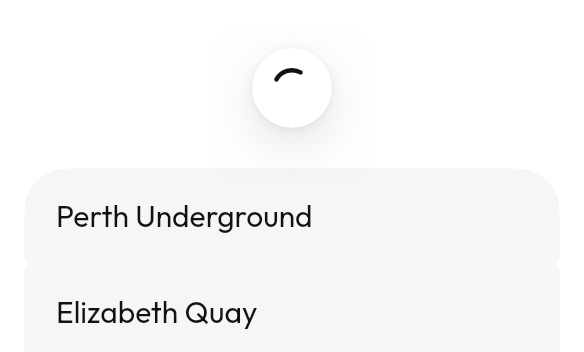

# `PullToRefresh`



Pull at the top of a list to reload. The indicator appears past a threshold, so
a list that is merely over-scrolled does not fire a request.

<!--sample:PullToRefreshBasics-->
```kotlin
PullToRefresh(refreshing = refreshing, onRefresh = { refresh() }) {
    LazyColumn {
        items(stops) { stop ->
            ListItem { +stop.name }
        }
    }
}
```

---

← [Collections](collections.md) · [All components](../components.md)
