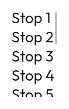

# `Scrollbar`

Purely an indicator, and hidden from the accessibility tree since it conveys
nothing the list does not already.

**Its visibility follows input modality, not platform.** Under an input that can
hover it is drawn; under touch it is **not drawn at all**, and the component
returns before laying anything out. A permanent scrollbar on a touchscreen is
wrong twice over — not draggable with a finger at any sensible width, and taking
space from the screens with least of it. On desktop and web the opposite holds:
a long list with no scrollbar reads as broken. Pass `alwaysVisible = true` to
override.

Hovering it thickens the thumb and takes it to full opacity, so it is a target
before you have to aim at it.

The full modality table is in
[`accessibility.md`](../accessibility.md#input-modality).

---

← [Collections](collections.md) · [All components](../components.md)
