# Selection

Controls that record a choice.

| | For | Instead of |
|---|---|---|
| [`Checkbox`](#checkbox) | An independent yes/no in a form | `Switch`, when it applies immediately |
| [`TriStateCheckbox`](#tristatecheckbox) | A parent whose children are partly selected | `Checkbox`, when there is no hierarchy |
| [`RadioButton`](#radiobutton) | One of a set — the control itself | `RadioGroup`, almost always |
| [`RadioGroup`](#radiogroup) | One of three or four visible options | `Select`, when there is no room to show them |
| [`Switch`](#switch) | A setting that takes effect immediately | `Checkbox`, when it takes effect on submit |
| [`SelectionRow`](#selectionrow) | **Any of the four above, with a label** | A bare control beside a `Text` — never do this |
| [`Chip`](#chip-filterchip-inputchip) | One of a *set* of small choices | `Button`, when there is only one |
| [`SegmentedControl`](#segmentedcontrol) | Two to four short options, switched often | `RadioGroup`, beyond four or with long labels |
| [`ColorSwatchPicker`](#colorswatchpicker) | A choice made by looking | `Select`, for anything nameable |
| [`Slider`](#slider) | A value in a continuous range | A `NumberField`, when the exact figure matters |
| [`RangeSlider`](#rangeslider) | A band — two values on one track | Two `Slider`s, which cannot stop each other crossing |
| [`Stepper`](#stepper) | A small exact count | A `Slider`, when the number is approximate |
| [`Rating`](#rating) | A score out of five | A `Slider`, when the scale is not a score |

**The single most important rule on this page:** every one of these belongs
inside a [`SelectionRow`](#selectionrow) unless something else is already
labelling it. A bare control with a `Text` beside it gives the user a small
target and gives a screen reader two nodes for one choice.

---

## `Checkbox`


<!--sample:CheckboxBasics-->
```kotlin
var notify by remember { mutableStateOf(false) }

Checkbox(checked = notify, onCheckedChange = { notify = it })
```

The tick is drawn on a `Canvas` and *strokes itself on* along its path rather
than fading in, with the box springing up to meet it. Two frames of personality
on a control people tap dozens of times a session.

`onCheckedChange` is nullable, and passing `null` makes the checkbox **inert but
still stateful** — the enclosing row owns the click and the checkbox is there to
show state. It is not the same as `enabled = false`, which says the choice is
unavailable.

Inert still means it announces `Role.Checkbox` and its tick. That matters inside
a [`SettingRow`](collections.md#settingrow), which is `clickable` rather than
`toggleable` and so publishes no checked state of its own; without the control
saying it, the row announces as a button with a name and no on or off.
`InertControlPublishesStateTest` covers all three controls.

**The box answers the press, not the release.** The tick starts being drawn under
the finger and starts being rubbed out under a press on a ticked box — a third of
the way, so a press-and-slide-off still comes back. `RadioButton` does the same
with its dot. A switch's thumb has stretched like this since it was written; these
two sat still until the value committed, so the same tap read as responsive on one
control and dead on the others. Inside a `SelectionRow` they read the row's press,
which is what `LocalRowInteractionSource` was always for.

## `TriStateCheckbox`


<!--sample:TriStateCheckboxBasics-->
```kotlin
var routes by remember { mutableStateOf(listOf(true, false, false)) }

val state = when {
    routes.all { it } -> ToggleableState.On
    routes.none { it } -> ToggleableState.Off
    else -> ToggleableState.Indeterminate
}

TriStateCheckbox(
    state = state,
    onClick = { routes = List(routes.size) { state != ToggleableState.On } },
)
```

`ToggleableState.Indeterminate` draws a dash, for a parent whose children are
partly selected. Clicking an indeterminate checkbox should select everything,
not clear it — that is the caller's decision, and the common wrong answer.

---

## `RadioButton`


The control on its own. You almost never want this directly — see below.

## `RadioGroup`

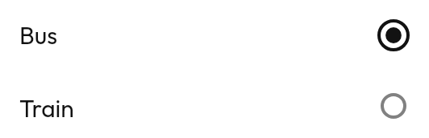

<!--sample:RadioGroupBasics-->
```kotlin
var mode by remember { mutableStateOf(Mode.Fastest) }

RadioGroup(
    options = Mode.entries,
    selected = mode,
    onSelectedChange = { mode = it },
    label = { it.displayName },
    supporting = { it.explanation },
)
```

**Use `RadioGroup` rather than loose buttons.** Owning the selection there is
what lets the group apply `selectableGroup()`, which is what makes a screen
reader announce "option 2 of 5". It also makes the invalid states — two
selected, or none — unrepresentable.

It is generic in the option type, so the caller keeps their own enum or data
class and supplies `label` rather than mapping to strings and back.

**Reach for a `RadioGroup` above a [`Select`](text-editing.md#select)** when
there are three or four options and room to show them. A select hides its
options behind a tap, a cost worth paying only when showing them would crowd the
screen. Above roughly a dozen, use `Combobox` so the user can type rather than
scroll.

---

## `Switch`

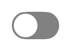
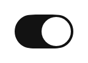

<!--sample:SwitchBasics-->
```kotlin
var liveAlerts by remember { mutableStateOf(true) }

Switch(checked = liveAlerts, onCheckedChange = { liveAlerts = it })
```

**Use a switch for a setting that takes effect immediately, and a `Checkbox` for
one that is part of a form and takes effect on submit.** A user who flips a
switch expects the thing to have happened; a user who ticks a box expects to
press Save.

The thumb stretches as it travels — wider mid-flight, round at rest — and keeps
its 3dp of clearance on both sides the whole way, growing into whichever side has
the room. At either end that is all behind it, so the stretch trails the way give
should. The off track is bordered and unfilled rather than grey-filled: a grey
track sits too close in tone to the surfaces it is toggled on top of to read as a
distinct control.

---

**Drag the thumb.** A switch is the most draggable-looking control there is, and
a drag that stops short of the middle springs back rather than toggling. Wherever
the finger lets go, that is where the spring starts from — there is one position
for the thumb, not a drag position and a separate resting animation that have to
agree. It works inside a `SelectionRow` too, where the row still owns the tap —
the row publishes its own toggle for the switch to drag against.

## `SelectionRow`

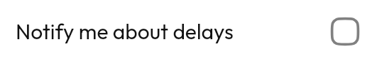
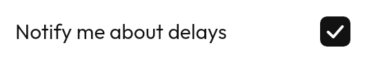

<!--sample:SelectionRowBasics-->
```kotlin
var notifyOnDelay by remember { mutableStateOf(false) }

SelectionRow(
    selected = notifyOnDelay,
    onSelectedChange = { notifyOnDelay = it },
    role = Role.Checkbox,
) {
    +"Notify me about delays"
    supporting { +"Only for favourited routes" }
    // The row owns the interaction; the control is here to show state.
    trailing { Checkbox(notifyOnDelay, onCheckedChange = null) }
}
```

**This is the form almost every checkbox, radio and switch should take.** The
nested control takes `onCheckedChange = null` — the row owns the interaction,
the control is there to show state.

It takes [`ListItem`](collections.md#listitem)'s builder rather than one of its
own, because a selection row is a list row that happens to toggle. Which slot
the control goes in *is* its position — there is no `controlPosition`, and
`leading` suits a list of options being picked from where `trailing` suits a
settings list.

`role` is required rather than inferred, because the row cannot see which
control you nested in it.

---

## `Chip`, `FilterChip`, `InputChip`

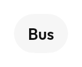
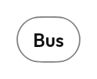
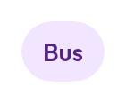
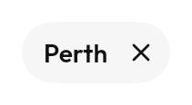

Chips are for things that come in *sets*. A single chip on a screen is usually a
small button wearing the wrong clothes.

| | |
|---|---|
| `Chip` | Presses like a button. `onClick` |
| `FilterChip` | On or off, and shows which. `selected` + `onClick` |
| `InputChip` | Something the user entered, with a remove button. `onRemove` + `removeLabel` |

<!--sample:FilterChipGroup-->
```kotlin
var active by remember { mutableStateOf(setOf(Mode.Fastest)) }

ChipGroup {
    Mode.entries.forEach { mode ->
        FilterChip(
            selected = mode in active,
            onClick = {
                active = if (mode in active) active - mode else active + mode
            },
            selectedIcon = Tabler.Outline.Check,
        ) {
            +mode.displayName
        }
    }
}
```

A selected `FilterChip` fills with the accent container and takes the accent for
its label, dropping the outline it wears unselected — the two images above are
the whole difference.

**The tick is opt-in**, through `selectedIcon`. Pass one and it expands in and
shoves the label across, which is what makes a filter bar feel responsive when
you rattle through several. It is not a default because the library ships no
glyphs at all — the icon set is yours — so there is no tick here to reach for.

Pass one when it matters which chips are on. Without it selection is carried by
colour alone, which is legible but is a single channel, and a filter bar is
exactly the place someone scans rather than reads.

`InputChip`'s `removeLabel` is **required** and announces the remove button —
"Remove Perth Station", not "Remove". It used to default to `"Remove $label"`;
with the label in a slot there is no string to interpolate, and a bare "Remove"
in a row of five chips tells a screen-reader user nothing about which one goes.
The remove button is a separate target with its own description, so a screen
reader offers "Perth Station" and "Remove Perth Station" as distinct actions.

`ChipGroup` wraps onto new lines rather than scrolling horizontally — a
scrolling row hides options off the edge of the screen.

---

## `SegmentedControl`

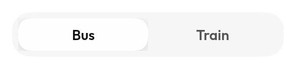

<!--sample:SegmentedControlBasics-->
```kotlin
var selected by remember { mutableStateOf(0) }

SegmentedControl(
    options = listOf("Bus", "Train", "Ferry"),
    selected = selected,
    onSelectedChange = { selected = it },
)
```

Two to four short options the user switches between often. Beyond four, or with
long labels, use a [`RadioGroup`](#radiogroup) or a
[`Select`](text-editing.md#select); segments get too narrow to read and too
narrow to hit.

It takes `List<String>` rather than a slot on purpose — a segment that could
hold arbitrary content is a segment that can be made too wide to fit beside
three others, and the cap at four short labels is the component's whole
premise.

The indicator is a single surface that **slides** between positions rather than
each segment fading its own background — that is what makes it read as one
physical thing with a moving part. It shares
`foundation/SelectionIndicator.kt` with the four navigation surfaces, so they
cannot drift apart.

**Not to be confused with `TabBar`.** A segmented control switches a *value*;
tabs switch which *view* of one screen you are looking at. Announced
`Role.RadioButton` per segment, where a tab announces `Role.Tab`.

---

**Drag across the segments** and the thumb comes with you, ticking at each
boundary. The gesture is on the track rather than on each segment: a drag from
"Depart" to "Arrive" leaves the segment it began in, and a per-segment handler
loses the pointer at the boundary. Taps still belong to the segment under them.

## `ColorSwatchPicker`

<!--sample:ColorSwatchPickerBasics-->
```kotlin
var accent by remember { mutableStateOf(RouteColor.Red) }

ColorSwatchPicker(
    value = accent,
    options = RouteColor.entries,
    onValueChange = { accent = it },
    swatchColor = { it.color },
    swatchLabel = { it.displayName },
)
```

A grid of swatches rather than a dropdown of colour names, because the choice
being made is visual: "which of these do I like" is answered by looking, and a
list that shows one colour at a time makes the user open it six times.

**The tick is drawn in whatever colour is legible on the swatch**, resolved
through `contentColorFor()`. A fixed white tick vanishes on pale yellow and a
fixed black one vanishes on navy, and a picker whose selection is invisible on
two of its own options has a bug in it.

`swatchLabel` is required, not optional. A colour with no name is unusable to
anyone who cannot see it — and to anyone who can, describing it over the phone.

Options whose `swatchColor` is `null` render as an outlined swatch with
`automaticIcon`, for a "match the system" entry.

---

## `Slider`

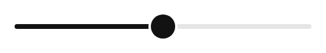

<!--sample:SliderBasics-->
```kotlin
var walkSpeed by remember { mutableStateOf(4f) }

Slider(
    value = walkSpeed,
    onValueChange = { walkSpeed = it },
    valueRange = 2f..7f,
    steps = 4,
    // Without this the announcement is a bare percentage, which is not the
    // number the user is choosing.
    stateDescription = { "${it.roundToInt()} km/h" },
)
```

The thumb grows while dragged and settles back with a bounce, and it **stretches
toward whatever is pulling on it** — the finger, while a stepped drag is held
between two notches, and its own destination while it is travelling to one. It
is round again the moment nothing is straining it, and a continuous drag keeps
it round throughout, because a thumb pinned to the finger is not straining
against anything. Each step crossed on a stepped slider fires a tick haptic, so a
user changing a value without looking can feel the detents — which is most of the
point of having steps.

**Pass `stateDescription`.** Without it the announcement is a bare percentage,
which is rarely what the number means.

`onValueChangeFinished` fires once on release, for the expensive thing you do
not want to run on every frame of a drag.

> A disabled slider still exposed `setProgress` to assistive tech, so it could
> not be dragged but could still be moved. The contract suite found it, and now
> checks that `enabled` is honoured on both paths.

**Reach for a `NumberField` instead** when the exact figure matters more than
the relative position — a slider is for "about this much", and nobody sets a
fare to $4.35 by dragging.

---

**Press anywhere and the thumb comes to the finger**, then follows it. A *tap*
springs the thumb across rather than teleporting it; a drag tracks exactly,
because a thumb that eases toward the finger holding it reads as lag.
`RangeSlider` does all of this and the detent easing too.

## `RangeSlider`

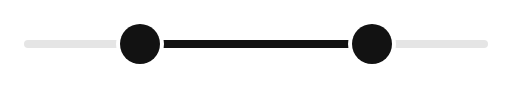

<!--sample:RangeSliderBasics-->
```kotlin
var window by remember { mutableStateOf(7f..19f) }

RangeSlider(
    value = window,
    onValueChange = { window = it },
    valueRange = 0f..24f,
    steps = 23,
    startContentDescription = "Earliest departure",
    endContentDescription = "Latest departure",
    stateDescription = { "${it.start.roundToInt()}:00 to ${it.endInclusive.roundToInt()}:00" },
)
```

Shares [`Slider`](#slider)'s drag accumulator and detent feel. The filled band
runs **between** the thumbs rather than from the start of the track, because the
band *is* the value.

**The two thumbs are two things to a screen reader.** One node cannot express
two values — a `ProgressBarRangeInfo` has a single `current` — so each thumb is
its own adjustable node, and each one's range is bounded by the other. "Adjust
to maximum" on the start thumb lands as far as a finger could take it — pushing the other
thumb ahead of it — rather than inverting the range or stopping somewhere a
finger would not have stopped.

### Two states worth knowing about

**A closed range** (`0.5f..0.5f`, both thumbs on the same pixel) is what "no
filter set yet" looks like, and it is the state a range slider gets stuck in.
Distance alone cannot say which thumb you grabbed, and picking the wrong one
opens the range in the direction the user did not ask for. The direction of the
first drag decides instead. There is one in the catalog for this reason.

**Crossing pushes.** Dragging the start thumb past the end shoves the end thumb
along in front of it and keeps going, stopping only at the end of the track. It
used to stop dead against its neighbour, which jams the control at exactly the
moment the user is asking for the narrowest range there is and breaks the one
promise a drag makes — that the thing under your finger goes where your finger
goes. The range still never *swaps*: a range that inverts under the finger is one
the user has to drag twice to fix. The pushed thumb lags a little and stretches
while it lags, so being shoved looks like being shoved.

**`minDistance`** is the narrowest the range may be, in the units of
`valueRange`. A departure window of "no less than twenty minutes" is a real
requirement and there was no way to say it. Both thumbs respect it, from a drag
and from assistive tech alike — each thumb's announced range ends where a finger
would have to stop. A minimum wider than the range itself is clamped to the
span, so it asks for the whole track rather than inverting the arithmetic.

```kotlin
RangeSlider(
    value = window,
    onValueChange = { window = it },
    valueRange = 0f..24f,
    minDistance = 1f,
    steps = 23,
)
```

**Reach for two `Slider`s instead** only if the two values are genuinely
independent. If one must not exceed the other, they are a range, and two sliders
cannot enforce that between them.

---

## `Stepper`

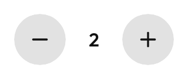

<!--sample:StepperBasics-->
```kotlin
var adults by remember { mutableStateOf(1) }

Stepper(
    value = adults,
    onValueChange = { adults = it },
    contentDescription = "Adults",
    range = 1..9,
)
```

A bounded count with a button at each end. `format` renders the number, for
units — `format = { if (it == 1) "1 bag" else "$it bags" }`.

**The buttons disable individually at each end of `range`**, rather than the
whole control disabling or the value silently refusing to move. A `+` that looks
live and does nothing is the defect this shape exists to avoid, and it is
*announced* as unavailable, not just drawn greyed — which is the half a
screen-reader user gets.

A `step` that would overshoot disables too: with `range = 0..10` and `step = 4`,
the button is dead at 8 rather than clamping to 10, which is a value the step
sequence never contains.

**The number between the buttons is not its own node.** It is the control's
`stateDescription`, so a screen reader says "Adults, 2" rather than offering an
unlabelled "2" between two buttons.

**Reach for a [`Slider`](#slider) instead** when the number is approximate and
the range is wide. A stepper is for a count someone knows exactly and will change
by one or two; nobody taps `+` thirty times.

---

## `Rating`


<!--sample:RatingBasics-->
```kotlin
var rating by remember { mutableStateOf(0f) }

Rating(value = rating, contentDescription = "Your rating", onValueChange = { rating = it })

// No callback means read-only, which means not a control at all: no role,
// no touch target, one node saying "Average rating, 4.3 out of 5".
Rating(value = 4.3f, contentDescription = "Average rating")
```

**`onValueChange = null` makes it read-only, and read-only means it is not a
control at all** — no role, no touch target, no click action, one node saying
"Average rating, 4.3 out of 5".

That is the case that gets built wrong. Most ratings on any screen are
*averages*, and shipping those as five silent radio buttons gives a
screen-reader user five things to activate that do nothing —
[`EverythingRespondsTest`](../../building/testing.md#everythingrespondstest)
exists to catch exactly that.

Interactive, it is a `selectableGroup` of `Role.RadioButton` marks, because
picking one of five is what that is. Each announces its own value, so "3 out of
5" is a thing to navigate to and choose rather than a slider to drag blind.

A fractional `value` draws a partly-filled mark and only makes sense read-only —
a tap cannot mean 3.4. The fill is a hard clip over the empty glyph rather than
a gradient: a star is not a rectangle, and a gradient across one fills the
points before the body and reads as a smudge.

`icon` and `filledIcon` default to a star outline and a filled star, and are
parameters because a rating of hearts is a reasonable thing to want.

**Drag across the marks to set the score.** Each mark crossed ticks, so it can be
set without looking, and the taps still work. `allowHalf = true` lets a drag stop
on a half mark — the left half of a mark is `.5`, the right half is whole. Off by
default, because a rating that starts emitting `3.5` to callers who expected `4`
is a change of contract rather than a nicety.
