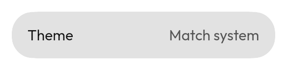

# `SettingRow`



The settings-screen shape: an icon, a label, and the current value on the right.
`onClick` is optional — a row that only displays a value does not need one.

<!--sample:SettingRowBasics-->
```kotlin
SettingRow(onClick = { save() }) {
    +"Live vehicle positions"
    supporting { +"Uses more data" }
}
```

**`SettingRow` is `clickable`, not `toggleable`.** It is a row you tap to open
something, which may happen to carry a switch. That is why a control inside it
must publish its own state — see
[`Checkbox`](checkbox.md).

**Reach for [`SelectionRow`](selection-row.md) instead** when tapping
the row *is* the toggle. `SettingRow` opens a screen; `SelectionRow` flips a
value.

---

← [Collections](collections.md) · [All components](../components.md)
