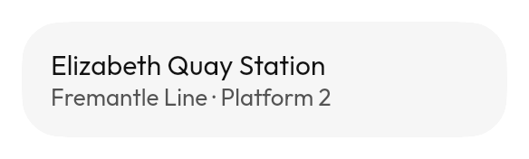
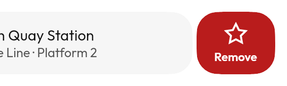

# `SwipeActions` / `SwipeToDismiss`




Actions revealed by a sideways drag. `SwipeActions` reveals buttons;
`SwipeToDismiss` removes the row.

At rest it is a row and nothing else, which is the honest picture and a useless
one — so the second image is a row driven open. Do that in your own code with
`rememberSwipeActionsState(initialValue = SwipeValue.End)` to start there, or
`state.animateTo(SwipeValue.End)` to move an already-drawn row, which is how you
would hint at the gesture on first run.

An action shows its label only where there is room for one. A single-line row is
48dp and an icon above a label wants 59, so on short rows the icon stands alone —
the label still reaches the screen reader through the row's custom action either
way.

**The drag has detents you can feel.** A tick each time another action is
uncovered, one distinct `DragThreshold` at the full-swipe point — the moment past
which letting go commits — and a settle when the row comes to rest. This row has
the most pronounced detents of any gesture in the library and was, until Round
13, the only draggable thing in it that was completely silent: the first feedback
you got was the action firing, by which time it was too late to change your
mind.

`SwipeToDismiss` **needs an undo**. A dismissal with no way back is a data-loss
bug wearing a gesture; pair it with a [`Toast`](../overlays.md) carrying the
undo.

<!--sample:SwipeToDismissBasics-->
```kotlin
SwipeToDismiss(
    onDismissRequest = { remove(stop.name) },
    label = "Remove",
    icon = Tabler.Outline.Trash,
) {
    ListItem {
        +stop.name
        supporting { +"${stop.routes} routes" }
    }
}
```

---

← [Collections](collections.md) · [All components](../components.md)
