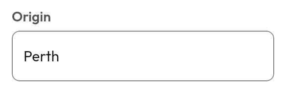
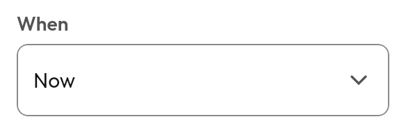

# Text editing

Every field is built on foundation's state-based `BasicTextField`, so the caller
owns a `TextFieldState` rather than a `String` plus a callback:

<!--sample:TextFieldBasics-->
```kotlin
val query = rememberTextFieldState()

TextField(state = query, label = "Where to?", placeholder = "Station, stop or address")
```

`TextFieldState` is the right default because it makes the two classic bugs
unrepresentable: the caret jumping to the end when text is edited
programmatically, and characters dropping under fast typing because state
hoisting round-tripped through a recomposition.

| | For | Instead of |
|---|---|---|
| [`TextField`](#textfield) | One line of anything | `TextArea`, when it can run long |
| [`TextArea`](#textarea) | Several lines | `TextField`, for a name or a code |
| [`SearchField`](#searchfield) | A query that filters as you type | `TextField`, when submission is explicit |
| [`PasswordField`](#specialised-fields) | A secret, with a reveal toggle | — |
| [`NumberField`](#specialised-fields) | Digits or decimals | `Slider`, for "about this much" |
| [`PhoneField`](#specialised-fields) | A number with a live mask | — |
| [`EmailField`](#specialised-fields) | An address | — |
| [`Select`](#select) | One of a fixed set | `RadioGroup`, at three or four options |
| [`MultiSelect`](#multiselect) | Any number of a fixed set | `ChipGroup` of `FilterChip`, when they fit on screen |
| [`Combobox`](#combobox) | One of a *long* fixed set | `SearchField`, for free text |
| [`rememberImeChain`](#keyboard-action-chaining) | Wiring a form's Next and Done | — |
| [`KontourTextToolbar`](#text-selection-toolbar) | The selection popup on desktop and web | — |

---

## `TextField`



Label, placeholder, supporting text, error, and leading/trailing slots.

`label` really is a `String?` here, not a slot — a field's floating label is
*chrome*, not content. It animates between two positions, is read by
`FieldScaffold` to set the control's accessible name, and has nowhere to put a
composable. That is the exception the [`+` vocabulary](../dsls.md) does not
cover, and it is deliberate.

Two variants from `TextFieldVariant`: `Outlined` and `Filled`. `Filled` takes a
`contrastEdge()` at the high-contrast tier, since a filled field on a filled
surface is otherwise two tones with no boundary.

## `TextArea`

Grows between `minLines` and `maxLines`, then scrolls internally. Growing rather
than scrolling from the first line is what lets a two-line note stay visible
while a long one stays contained.

## `SearchField`


A debounced query callback and an animated clear button. The debounce is the
point: a field that fires per keystroke into a network call produces a request
per letter and renders the results out of order.

**Reach for `SearchField` over `Combobox`** when the answer is free text and the
suggestions are a convenience. Reach for `Combobox` when the value must be one
of the options.

## Specialised fields

| | |
|---|---|
| `PasswordField` | Reveal toggle, autofill content type |
| `NumberField` | Digits or decimals, rejected at the keystroke |
| `PhoneField` | Live mask, digits stored clean |
| `EmailField` | Email keyboard, autofill, no capitalisation |

Each is `TextField` with the keyboard, autofill hint and transformation already
right. They exist because those three get forgotten one at a time, and a field
that capitalises the first letter of an email address is a bug nobody files.

`PasswordField` masks with an `OutputTransformation` — one bullet per character,
so every cursor offset still means what it says. `KeyboardType.Password` is an
IME *hint* and substitutes no glyphs; a field relying on it alone is plaintext,
which this one was for most of the project's life.

---

## `Select`



**A select is a field, not a button.** It shares `FieldScaffold` with
`TextField` rather than resembling it by hand — same frame, same label, same
helper and error slot — because in a form it *is* one of the fields, and a
select styled as a button in a column of text inputs reads as a different kind
of thing.

Its menu anchors to the field frame, using `Modifier.anchorBounds` and
`AnchoredDropdownMenu` rather than the parent-anchoring `DropdownMenu`: "the
parent layout" is the wrong node when the menu is declared in one slot of a row
and has to line up with the whole row. The menu matches the field's width.

**Reach for a [`RadioGroup`](selection.md#radiogroup) above a `Select`** when
there are three or four options and room to show them. A select hides its
options behind a tap, a cost worth paying only when showing them would crowd the
screen.

## `MultiSelect`

Picks any number; the menu stays open while toggling, because closing after each
choice makes selecting four things take four taps plus four reopenings.

**Reach for a [`ChipGroup`](selection.md#chip-filterchip-inputchip) of
`FilterChip`s instead** when the options fit on screen. Chips show the current
selection without being opened, which is most of what a filter bar is for.

## `Combobox`

A select the user can type into to narrow a long list. Above roughly a dozen
options, this rather than `Select`.

**A combobox is a select with search, not an autocomplete.** The value is always
one of the options, and typing something unmatched leaves the previous value
alone. For free text with suggestions, use a [`SearchField`](#searchfield) and
render results yourself — conflating the two gives a control where it is unclear
whether what you typed counts as an answer.

A command palette — a search field over *actions* rather than values — is
[not yet built](../components.md#not-yet-built), and is deliberately not this.

---

## Keyboard action chaining

<!--sample:ImeChainForm-->
```kotlin
val from = rememberTextFieldState()
val to = rememberTextFieldState()
val note = rememberTextFieldState()

val chain = rememberImeChain("from", "to", "note", onSubmit = { plan() })

TextField(state = from, label = "From", imeChain = chain["from"])
TextField(state = to, label = "To", imeChain = chain["to"])
TextField(state = note, label = "Note", imeChain = chain["note"])
```

Every field but the last shows **Next** and moves to the one after; the last
shows **Done** and submits. Without it a soft keyboard's action key does nothing,
and filling a three-field form means dismissing the keyboard and tapping the next
field between every entry — with the keyboard covering the field being tapped.

The order lives in one place, at the `rememberImeChain` call, rather than being
implied by three separate `imeAction` arguments that go wrong the first time
someone reorders the form. A chain overrides both `imeAction` and a specialised
field's own default: `PasswordField` defaults to Done, which is wrong for a
password halfway down a form.

## Text selection toolbar

`KontourTextToolbar` replaces Compose's selection popup with one drawn in the
design system — but **only on desktop and web**, where the default is a bare
unstyled row. On Android and iOS it is a deliberate no-op: the platform toolbar
there is a real system surface carrying "Look Up", "Translate", "Share", the
user's keyboard extensions and their configured text replacements, none of which
four buttons of our own can reproduce. Install it unconditionally at the root and
it does the right thing per platform.

---

## Validation

`errorMessage` sets `error` semantics *and* colours the border. Colour alone
would fail WCAG 1.4.1, so the message is not optional decoration — it is how a
screen-reader user learns there is a problem.

**Error outranks focus.** A focused invalid field keeps its error border,
because an accent ring would hide the thing the user needs to fix.

Helper and error text share one slot and animate in place, so a form does not
jump by a line height every time validation flips.

Every field carries its label as its accessible name. Compose has no
`labelledBy`, so a label drawn above a field is an unrelated node however close
it is on screen — `FieldScaffold` draws the label with `clearAndSetSemantics {}`
and puts the name on the control. Before the contract suite, **no text field or
select carried its label**: the user heard "Origin", moved on, and landed in an
unnamed edit box.

## Transformations

`InputTransformation` filters keystrokes *as they arrive* — the rejected
character never reaches the state, so the field cannot flicker through an
invalid value. The best error message is the one that never has to appear.

```kotlin
InputTransformation.digitsOnly()
InputTransformation.decimal(allowNegative = true)
InputTransformation.limit(10)
```

`OutputTransformation` changes what is *displayed* without changing what is
stored:

```kotlin
phoneMask()   // stored "0412345678"  displayed "0412 345 678"
cardMask()
timeMask()
```

That separation is the point: the caller reads clean digits out of the state and
never has to strip formatting back out, which is where mask implementations
usually go wrong.

`InputTransformation.decimal` is deliberately permissive about intermediate
states — `-`, `1.` and `-0.` all pass, because a user typing `-0.5` passes
through every one of them. Rejecting them makes the field impossible to type
into.
