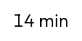

# `AnimatedCounter`



<!--sample:AnimatedCounterBasics-->
```kotlin
AnimatedCounter(value = minutesAway, format = { "$it min" })
```

For a figure that changes while the user is looking at it — minutes to the next
bus, an unread count, a fare as options are added. A number that simply swaps is
one the eye can miss entirely; one that rolls says *this changed* without a
highlight or a flash that has to be undone a moment later.

**Only the digits that changed move.** "14 min" to "13 min" rolls one column; the
`1` does not move and neither does " min". That is the difference between this
and a cross-fade of two strings: a cross-fade says the *value* changed, and this
says which part of it did. Digits roll **up** when the number grows and **down**
when it shrinks, so counting down to a departure looks like a departure board.

**The row does not twitch.** Every digit cell is the width of the widest digit in
the current font, measured once — the theme's face draws `1` at 23px and `0` at
42px, so a counter laid out naturally would change width as it counts and drag
whatever is beside it along. Non-digits keep their natural width, since they do
not change.

The cells are a dozen separate nodes, so the row carries the whole formatted
string as its own description and the cells are cleared — otherwise a screen
reader announces "one", "four", "space", "m", "i", "n".

---

## Accessibility

The announced value is `contentDescription`, defaulting to the text, set on the
whole control with every animating digit cleared. Without that a screen reader
would read a column of digits mid-flight, which is neither the old value nor the
new one.

Pass `contentDescription` where the digits are not the sentence — "4 minutes"
rather than "4".

It is not a live region: it does not announce itself when it changes. Where the
change is the point — a departure time counting down — that is
[`RelativeTimeText`](relative-time-text.md), which is.

---

← [Display and content](display.md) · [All components](../components.md)
