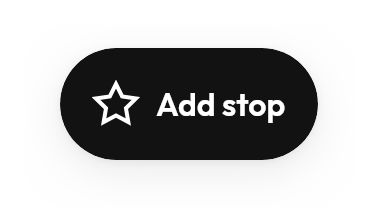

# `ExtendedFloatingActionButton`



<!--sample:ExtendedFloatingActionButtonCollapsing-->
```kotlin
ExtendedFloatingActionButton(
    icon = Tabler.Outline.Navigation,
    contentDescription = "Start trip to Perth Station",
    expanded = listState.firstVisibleItemIndex == 0,
    onClick = { start() },
) {
    +"Start"
}
```

It animates its *width* when collapsing rather than cross-fading between two
components, so the icon stays put and the label slides out from behind it.
Cross-fading makes the icon appear to jump sideways. `NavRail` uses the same
treatment when it expands.

`contentDescription` is separate from `label` because the label may be terse
where the announcement should not be — "Start" on screen, "Start trip to Perth
Station" for a screen reader.

---

## Accessibility

The label is the accessible name while the button is expanded;
`contentDescription` takes over once it has collapsed to an icon. Write the two
to say the same thing, or the control is called one name at the top of a list and
another after the user has scrolled.

Collapsing is driven by the caller (`expanded`), so it can be tied to something
other than scroll — but whatever drives it, the name has to stay stable.

It floats over content. Anything scrolling underneath needs bottom padding to
match, or the last row can never be read.

---

← [Actions](actions.md) · [All components](../components.md)
