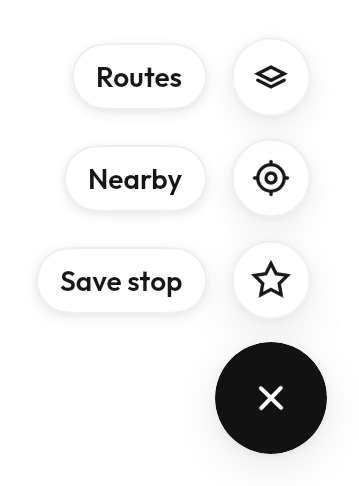
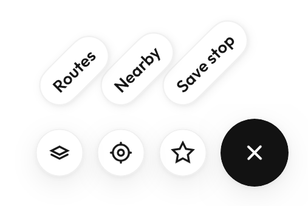
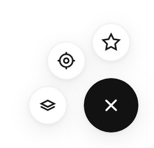

# `FabMenu`



<!--sample:FabMenuBasics-->
```kotlin
var open by remember { mutableStateOf(false) }

FabMenu(
    expanded = open,
    onExpandedChange = { open = it },
    icon = Tabler.Outline.Plus,
    contentDescription = "Add",
) {
    item(Tabler.Outline.Star, "Save stop") { save(); open = false }
    item(Tabler.Outline.CurrentLocation, "Nearby") { nearby(); open = false }
    item(Tabler.Outline.Navigation, "Directions") { start(); open = false }
}
```

The anchor **is** a `FloatingActionButton` — same `FabSize`, same shape, same
press scale — so a screen that already has a FAB gains a menu by changing the
call rather than by swapping the component for a lookalike. The plus rotates 45°
into a cross as it opens; pass `expandedIcon` when the resting icon is something
a rotation does not usefully transform.

**Three layouts, and none of them takes a direction.**

| | | |
|---|---|---|
| `Vertical` |  | The default. Labelled, because a column has room. |
| `Horizontal` |  | A row beside the button. |
| `Fan` |  | An arc. Icons only — a diagonal leaves a label nowhere to go. |

All three pick which way to open from where the button finds itself in the
window: bottom-right opens up and to the left, top-left opens down and to the
right, and nothing has to be told which corner it is in. Where the room runs out
the spacing **compresses** rather than clamping — clamping each item to the
window independently puts every item past the wall on the same point, and three
actions become one pile with two of them unreachable.

**The items render into the [`OverlayHost`](../overlays.md)**, anchored to the
FAB, for the reason a menu does: a FAB sits in a corner, and items expanding out
of a corner leave whatever box put it there. The FAB itself stays put, behind a
transparent scrim — so tapping it again closes the menu without a second handler,
the same bargain `DropdownMenu` strikes with its trigger. Pass
`scrim = ScrimStyle.Dimmed` where the actions deserve the whole screen.

<!--sample:FabMenuFan-->
```kotlin
var open by remember { mutableStateOf(false) }

FabMenu(
    expanded = open,
    onExpandedChange = { open = it },
    icon = Tabler.Outline.Stack,
    contentDescription = "Map layers",
    layout = FabMenuLayout.Fan,
    expandedIcon = Tabler.Outline.X,
    scrim = ScrimStyle.Dimmed,
) {
    item(Tabler.Outline.Bus, "Buses") { openLayers() }
    item(Tabler.Outline.Train, "Trains") { openLayers() }
    item(Tabler.Outline.Bike, "Bike paths") { openLayers() }
}
```

The items leave **one after another**, nearest first, and gather back into the
button furthest-first — which is what makes it read as one thing unfolding
rather than five things appearing. Under `reduceMotion` the stagger is dropped
entirely: a sequence is still movement, and it drags the eye across the screen
exactly as that preference asks it not to.

Each item is a real button with its own touch target, so the 48dp minimum
applies to every one of them rather than to the menu as a whole.

> Items default to `surfaceRaised` with a **hairline border**, and the border is
> not decoration. In the light scheme `background`, `surface` and `surfaceRaised`
> are all the same white, so a light FAB without it is a white circle on a white
> page held together by its shadow alone — legible over a map, and not much else.
> It is the same hairline `OverlaySurface` puts round every menu and popover.
> Pass `itemBorder = null` on a menu that only ever floats over photography.

---

## Accessibility

The trigger's `contentDescription` **changes when the menu opens** —
`expandedContentDescription` — so a screen reader is told the control now closes
rather than opens. That is the pattern for any button whose meaning flips.

Each item announces its own `label`; the icon inside it is cleared, so the label
is heard once.

The menu is a set of buttons that appear on demand, so the same rule as a context
menu applies: an action that lives only here is unreachable for anyone who does
not find the trigger.

---

← [Actions](actions.md) · [All components](../components.md)
