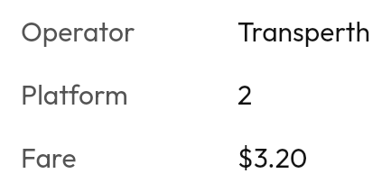

# `KeyValueList`



<!--sample:KeyValueListBasics-->
```kotlin
KeyValueList {
    item("Operator", "Transperth")
    item("Platform", "2")
    item("Fare", "$3.20")
    // A slot draws nothing a screen reader can read, so it says what to
    // announce instead.
    item("Accessible", announcement = "yes") { +Tabler.Outline.Check }
}
```

**Not a [`SettingRow`](setting-row.md).** They draw almost the same
row, and the difference is the whole reason both exist:

| | `KeyValueList` row | `SettingRow` |
|---|---|---|
| What it is | text | a control |
| Role | none | `Role.Button` |
| Touch target | none | yes |
| Pressing it | nothing | opens something |

Using a setting row for facts gives a screen-reader user a list of buttons that
do nothing, which is worse than the visual duplication it saves. If one row needs
to become tappable, it is not one of these — move it out and leave the rest.

**Narrow rows stack.** Below about 216dp — `labelWidth` plus a value column worth
having — each pair becomes label above value instead of side by side. The label
column had a floor and the value had no weight at all, so anything under about
120dp gave the label the whole row and left the value drawing its first character
outside the component, one glyph wide. The floor is capped now, so a long label
pushes its column out but can never starve the value.

**Each row announces as a pair**, "Platform, 2". Separate nodes make the reader
hold the label while waiting for the value, and the pairing is the entire
content. A row whose value is not text needs `announcement` — a tick icon in an
"Accessible" row otherwise announces as "Accessible" and stops, which reads as a
row with its value missing.

`labelWidth` is a fixed minimum rather than intrinsic, so the values line up down
the column. A ragged value column is what makes a details panel look untidy, and
an intrinsic width re-rags it every time the content changes.

---

## Accessibility

Each row merges into one `contentDescription` — `"$label, $value"` — so a screen
reader hears "Platform, 2" as one fact rather than two nodes it has to associate.

`announcement` overrides the spoken form for a value whose written form does not
read aloud: "8m" announced as "8 minutes", "PLT 2" as "Platform 2".

A row is **not** a control. It has no role, no touch target and no press — that
is [`SettingRow`](setting-row.md), and the distinction is why a key-value list
does not appear as a list of buttons a user has to try.

---

← [Display and content](display.md) · [All components](../components.md)
