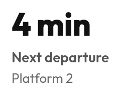

# `Stat`



<!--sample:StatBasics-->
```kotlin
Stat {
    value("4 min")
    +"Next departure"
    supporting("Platform 2")
    trend(StatTrend.Positive, "2 min earlier than usual")
}
```

The label goes **under** the value. A dashboard is scanned by its numbers — the
reader finds the big thing first and then asks what it is, and a label on top
makes them read every caption to find the figure they came for.

**Spoken, that order is backwards.** So the block merges into one announcement
and reverses it: "Next departure. 4 min. Platform 2" — the label first, because
"4 min" before anything has said what is four minutes away is a number with no
subject. Pass `announcement(…)` for a figure a reader would mangle: "1.2k" is
said as "one point two kay".

`StatTrend` is `Positive`, `Negative` or `Neutral` — **sentiment, not
direction**. A departure two minutes earlier is good news and points down; a
fare two dollars higher is bad news and points up. Nothing in the component can
tell which.

**Reach for a `KeyValueList` instead** when there are several figures and none is
the headline. A screen with six stats has no headline, which is the same as
having none.

---

## Accessibility

The whole block merges into one `contentDescription`, in the order a person would
say it: label, value, change. Three separate nodes would be three facts a screen
reader user has to reassemble, and the change — "+12%" — means nothing on its
own.

Where the value's written form does not read aloud, give the spoken form: "8m"
announced as "8 minutes".

A stat is not a control. If it opens something, it needs a role — put it in a
[`Card`](card.md) with `onClick`.

---

← [Display and content](display.md) · [All components](../components.md)
