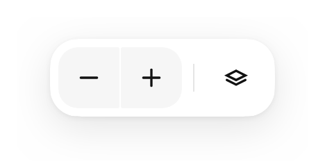

# `Toolbar`

*Also on this page: `ToolbarDivider`.*



<!--sample:ToolbarBasics-->
```kotlin
Toolbar {
    ButtonGroup {
        item(
            onClick = { zoomOut() },
            contentDescription = "Zoom out",
            icon = Tabler.Outline.Minus,
        )
        item(onClick = { zoomIn() }, contentDescription = "Zoom in", icon = Tabler.Outline.Plus)
    }
    ToolbarDivider()
    IconButton(Tabler.Outline.Stack, "Map layers", onClick = { openLayers() })
}
```

A floating surface holding actions, over content it does not belong to — the
controls over the map.

**Deliberately thin**: a `Surface` and a `Row`. It earns its place the way
[`Card`](card.md) does, by fixing the elevation, shape, padding and
traversal semantics in one place so a second toolbar does not grow a second set
of numbers.

**Its corners are concentric with what it holds.** `ToolbarDefaults.Shape` is
one rung up the shape scale from the controls inside — the scale climbs in even
6dp steps and the content padding is 6dp, so `medium` around `small` puts the two
curves exactly parallel. Where a gap is not a whole rung,
[`inset`](../tokens.md#shape) derives the inner shape rather than leaving you to
pick a token and hope. It was a pill until a `ButtonGroup`'s corners were
found poking through it and being sheared flat. If your toolbar holds nothing
but circular `IconButton`s, `Theme.shapes.pill` is the concentric choice there
and worth passing.

**It is not a [`TopBar`](top-bar.md).** A top bar is *part of* the
screen — it holds the title and sits at the top. A toolbar floats **over**
content that is not its own, which is why it has a shadow and rounded corners
and a top bar has neither. If it is the screen's chrome, it is a top bar.

For a translucent one over a live map, use `GlassSurface` and read the note in
[adaptive](adaptive.md#there-is-no-portable-backdrop-blur) — there is no
portable backdrop blur.

---

## Accessibility

An `isTraversalGroup`, and `minTouchTarget` reserved on the row rather than per
button — the same arrangement as [`ButtonGroup`](button-group.md), for the same
reason.

Every item is an icon button and needs its own `contentDescription`.
`ToolbarDivider` is presentational and carries none.

A floating toolbar sits over content. Where it is over something scrollable, that
content needs padding to match, or the rows underneath it can never be read.

---

← [Actions](actions.md) · [All components](../components.md)
